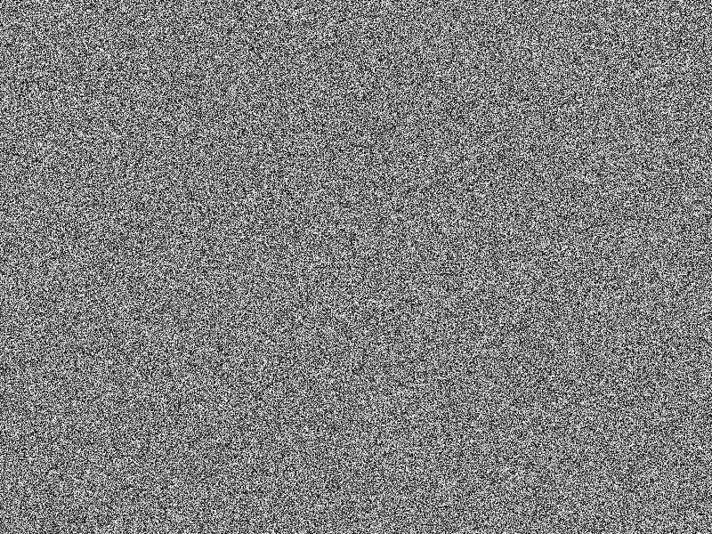
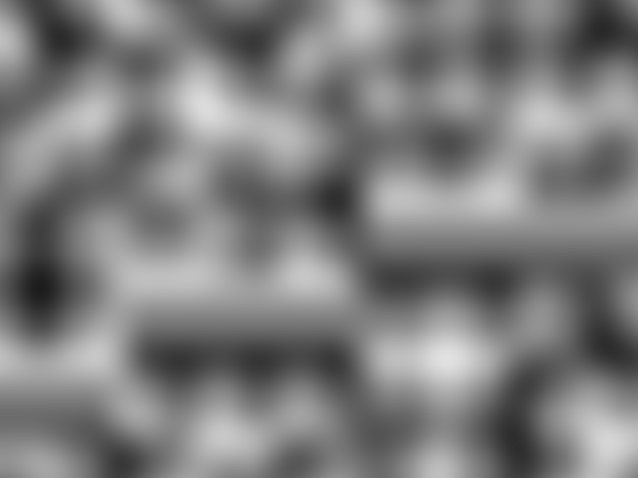
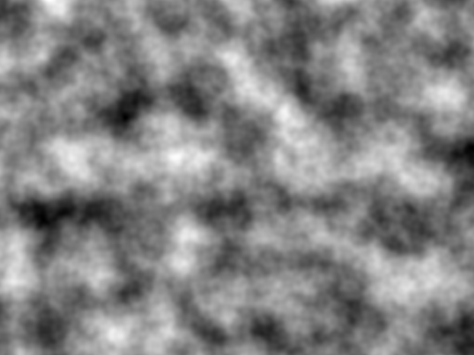
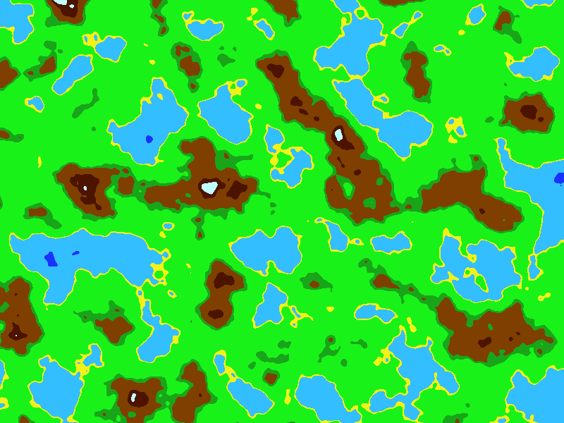
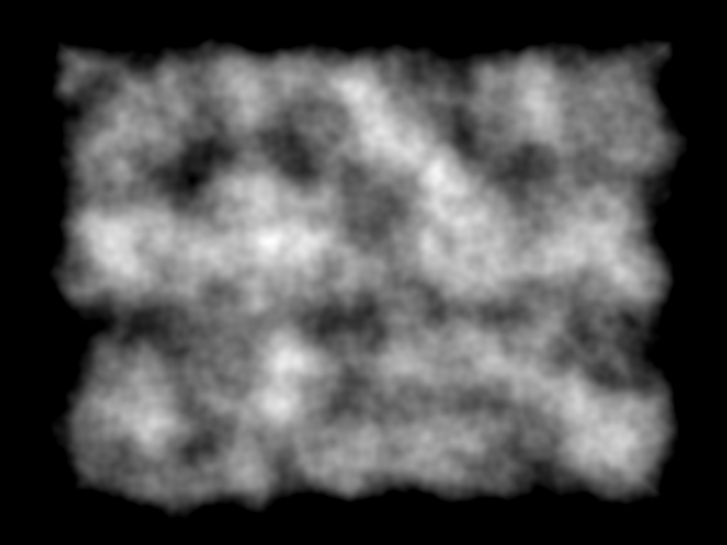
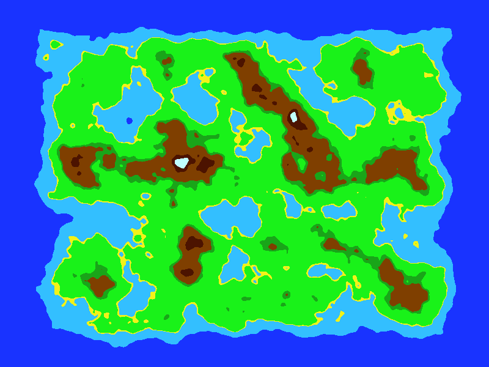

# Noise-generator
A Noise Generation Library written in C++. 

The main types of Noise Generated are:-
- Random Noise

- Perlin Noise

- Perlin Noise with Octaves

- ColorMap

- FallOffMap

- Perlin with FallOff

- ColorMap with FallOff

